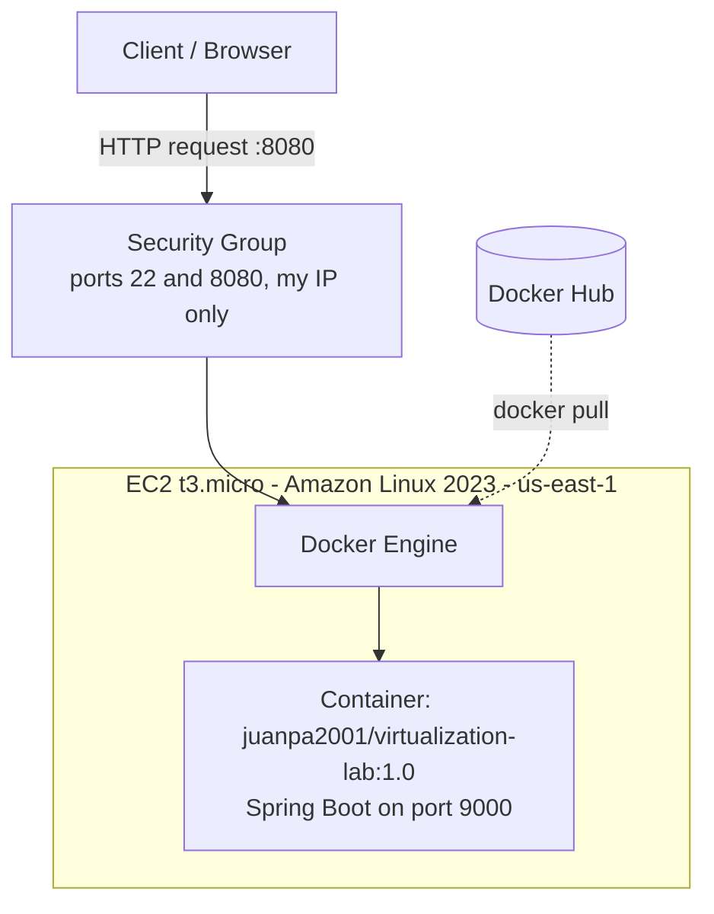

# Workshop: Containerizing and Deplaying a Java Web Application - SpringBoot

## Description
Simple SpringRest App. Invoke it via curl or browser.

Set url parameter **name**

Ex. `http://localhost:9000/greeting?name=Pedro`

### Run app

```shell 
    mvn clean package
    java -jar .\target\virtualization-lab-1.0.0.jar
```

## Evidence PART 1

+ Testing via curl
  
+ Testing via browser
  

## PART 2
we created and configured the Dockerfile.Then built the image and runned it with:

```shell 
    docker build -t <ExUser>/virtualization-lab:1.0 . 
```

```shell 
    docker run -d `
    --name virtualization-lab-1 `
    -e PORT=9000 `
    -p 34000:9000 `
    ExUser/virtualization-lab:1.0    
```

Then we tested the image in the browser using: http://localhost:34000/greeting?name=Container


Finally, we runned two isolated instances

```shell 
    docker run -d `
    --name virtualization-lab-2 `
    -e PORT=9000 `
    -p 34001:9000 `
    ExUser/virtualization-lab:1.0    
```

```shell 
    docker run -d `
    --name virtualization-lab-3 `
    -e PORT=9000 `
    -p 34002:9000 `
    ExUser/virtualization-lab:1.0    
```

Each container responds independently on its own mapped port:

- http://localhost:34000/greeting?name=Container1
- http://localhost:34001/greeting?name=Container2
- http://localhost:34002/greeting?name=Container3


## PART 3

We created `compose.yml` and configured it eith mongodb.

After that, we built and started the compose and tested the url `http://localhost:8087/greeting?name=Compose`

```shell
    docker compose up -d --build
```


Finally, we inspected the db from inside its container using:

```shell
    docker compose exec db mongosh
```

and asked for:

```MongoDB
    show dbs
    use workshop
    db.messages.insertOne({ message: "Hello from Docker Compose" })
    db.messages.find()
```


## PART 4

We logged in to Docker Hub and published the image with both tags.

```shell
docker login
```

```shell
docker tag juanpa2001/virtualization-lab:1.0 juanpa2001/virtualization-lab:latest
docker push juanpa2001/virtualization-lab:1.0
docker push juanpa2001/virtualization-lab:latest
```

Docker Hub repository: https://hub.docker.com/r/juanpa2001/virtualization-lab

To pull the image from anywhere:

```shell
docker pull juanpa2001/virtualization-lab:1.0
```


## PART 5

We created an Amazon Linux 2023 EC2 instance and configured its security group
to allow inbound traffic only from our own IP, on ports 22 (SSH) and 8080 (app).

We connected via SSH and installed Docker:

```shell
sudo yum update -y
sudo yum install -y docker
sudo service docker start
sudo usermod -a -G docker ec2-user
```

We pulled the published image from Docker Hub and ran it:

```shell
docker pull juanpa2001/virtualization-lab:1.0

docker run -d \
  --name virtualization-lab \
  --restart unless-stopped \
  -e PORT=9000 \
  -p 8080:9000 \
  juanpa2001/virtualization-lab:1.0
```

We verified the container was running and the app started correctly:

```shell
docker ps
docker logs virtualization-lab
```


Finally, we tested the public endpoint from a browser outside the instance:

http://ec2-100-26-150-131.compute-1.amazonaws.com:8080/greeting?name=AWS


## PART 6: Deployment model and cost analysis

### Deployment model



| Layer | Responsibility |
|---|---|
| EC2 virtual machine | Isolated compute, memory, storage and network resources rented by the hour. |
| Docker container | Portable execution environment with the application and its runtime (Corretto 21). |
| Java web application | Receives HTTP requests and provides the `/greeting` functionality. |
| Security group | Controls which inbound traffic reaches the VM (22 and 8080, only from my IP). |

### Workload assumptions

| | Small | Medium | Large |
|---|---|---|---|
| Requests per month | 10,000 | 100,000 | 1,000,000 |
| Region | us-east-1 | us-east-1 | us-east-1 |
| Instance type | t3.micro | t3.micro | t3.micro |
| Number of instances | 1 | 1 | 2 (two Availability Zones) |
| Monthly runtime | 730 h (continuous) | 730 h (continuous) | 730 h each (continuous) |
| EBS storage | 8 GB gp3 | 8 GB gp3 | 8 GB gp3 per instance |
| Avg. request / response size | ~0.5 KB / ~1 KB | ~0.5 KB / ~1 KB | ~0.5 KB / ~1 KB |
| Outbound transfer (actual) | ~10 MB | ~100 MB | ~1 GB |
| Load balancer | No | No | Yes (Application Load Balancer) |
| High availability | No | No | Yes |

Calculator notes:
- The AWS Pricing Calculator does not accept fractional values, so outbound transfer was entered as 1 GB in all scenarios. It also does not apply the free 100 GB/month allowance, so it adds USD 0.09 that real billing would not charge.
- For the ALB, the LCU dimensions were rounded up to the minimum accepted values (1 LCU, USD 5.84/month). Real consumption at ~0.4 requests per second is far lower.
- The calculator estimate does not include the public IPv4 addresses used by the ALB itself (one per Availability Zone, about USD 7.30/month). Including them, the Large workload would cost about USD 53.42/month.
- No Free Tier is assumed. All estimates use On-Demand pricing at 730 h/month.

### Cost estimate

| Scenario | Monthly requests | Monthly infrastructure cost | Estimated cost per request | Main cost drivers |
|---|---|---|---|---|
| Small workload | 10,000 | USD 11.97 | USD 0.001197 | EC2 runtime ($7.59), public IPv4 ($3.65), storage ($0.64) |
| Medium workload | 100,000 | USD 11.97 | USD 0.0001197 | Same fixed costs; the same instance absorbs 10x more traffic |
| Large workload | 1,000,000 | USD 46.12 | USD 0.0000461 | 2 instances ($16.55), ALB ($22.27), public IPv4 ($7.30) |

Cost per request = monthly infrastructure cost / monthly requests.

Breakdown from the AWS Pricing Calculator:
- **Small and Medium:** EC2 USD 8.32 (instance 7.59 + EBS 0.64 + transfer 0.09) + VPC public IPv4 USD 3.65 = **USD 11.97**.
- **Large:** EC2 USD 16.55 + VPC public IPv4 USD 7.30 + Elastic Load Balancing USD 22.27 = **USD 46.12**.

AWS Pricing Calculator evidence (Small and Medium use the same infrastructure and the same estimate):


Large workload (2 instances + Application Load Balancer):


### Architectural discussion

**1. Why is there a baseline monthly cost even with few requests?**
An EC2 instance is billed for the time it is running, not for the requests it serves. The VM, its public IPv4 address and its EBS volume are reserved 24/7 whether the app receives 10 requests or 10,000. In the small scenario, more than 99% of the bill is fixed cost.

**2. At which workload level does the fixed cost become less significant per request?**
The fixed cost never disappears, but it is amortized over more requests. The cost per request drops from USD 0.001197 (small) to USD 0.0001197 (medium), a 10x reduction, because the same instance absorbs 10x more traffic at the same price. At 1,000,000 requests, even with two instances and a load balancer, the cost per request is about 26x lower than in the small scenario. From roughly 100,000 requests/month on, the fixed cost stops being the dominant concern per request.

**3. What would force a move from one instance to several?**
Availability: a single instance is a single point of failure (instance, disk or Availability Zone failure) and every deployment or reboot means downtime. Capacity: t3 instances are burstable, so sustained CPU use exhausts credits, and 1 GiB of RAM limits the JVM heap and concurrency. Operations: rolling updates without downtime also require at least two instances.

**4. Which additional services would production likely require?**
A load balancer (ALB) plus an Auto Scaling group, HTTPS with ACM certificates and Route 53 DNS, a managed database instead of a container (the MongoDB service would move to a managed offering), a container registry (ECR) integrated with IAM, monitoring and alarms (CloudWatch), backups (EBS snapshots / AWS Backup), and secrets management (Secrets Manager or SSM Parameter Store).

**5. Would serverless be more cost-effective for the small workload?**
Probably yes, judging by the workload. 10,000 requests/month is about one request every 4 minutes on average, so the instance is idle almost all the time while still billed every hour. Serverless billing is per invocation and execution time, so idle time costs nothing. The application is also stateless, which fits that model well. The trade-offs are cold starts (a JVM/Spring Boot function can take seconds to start, which affects latency for sporadic traffic) and the effort to adapt the packaging. If traffic were sustained and steady instead of sparse, the comparison would shift back toward always-on instances.

### Conclusion

For the small and medium workloads, a single t3.micro is technically sufficient (average load is well below 1 request per second) and costs about USD 12/month, which is appropriate for a workshop, a demo or a low-traffic internal tool, but it is inefficient per request at very low volume. For the large workload, availability requirements justify two instances plus a load balancer, raising the bill to about USD 46-53/month but lowering the cost per request. EC2 with Docker is an appropriate and transparent choice for learning virtualization and for steady workloads; for very sparse traffic, a pay-per-use model would likely be cheaper.

## Demo video

Short video showing the local Docker deployment (isolated containers and Docker Compose) and the application running on AWS EC2:

[Watch the demo video](https://www.youtube.com/watch?v=9y0e0wS77gM)